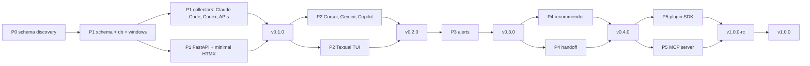

# Tokie — Implementation Plan (build-in-public, 6-week sprint)

> Companion to [TOKIE_DEVELOPMENT_PLAN_FINAL.md](TOKIE_DEVELOPMENT_PLAN_FINAL.md). That doc is the *what and why*. This doc is the *when and in what order*, compressed for a build-in-public cadence.

**Author effort model:** solo, part-time, ~25 hrs/week
**Total duration:** 6 calendar weeks
**Release cadence:** one tagged release per week, one public update per week
**Start:** Week 1, Day 1

---

## 1. Build-in-public principles driving the schedule

1. **Ship weekly.** Every Friday a new version is tagged and pushed to PyPI, even if small. No silent weeks.
2. **Exit-gate commits.** No week ends half-done. If a task slips, cut it before the tag, don't delay the tag.
3. **Dogfood from day 1.** Install Tokie on the author's own machine starting end of Week 1 and use it daily.
4. **Demo over docs.** Each weekly update ships a short screencap or screenshot, not a wall of text.
5. **Post-v1.0 is a cliff.** Browser extension, menu-bar apps, team edition — all deferred. Don't negotiate with scope creep.

---

## 2. Timeline at a glance

| Week | Tag | Phase | Theme | Exit demo |
|------|-----|-------|-------|-----------|
| 1 | `v0.1.0` | Phase 0 + 1 | Schema, scaffold, core, minimal dashboard | `uv tool install tokie-cli` shows Claude Code usage on `127.0.0.1:7878` |
| 2 | `v0.2.0` | Phase 2 | Cursor + Gemini + Copilot + Textual TUI | Live TUI with 5 collectors + dashboard v2 (dark mode, burn rate) |
| 3 | `v0.3.0` | Phase 3 | Threshold alerts | Desktop notification at 75% of Claude Pro weekly cap |
| 4 | `v0.4.0` | Phase 4 | Recommender + guided handoff | Hit cap → clipboard has continuation prompt + ranked tool list |
| 5 | `v1.0.0-rc` | Phase 5 | Plugin SDK + MCP server | Claude Code MCP queries `get_remaining` live |
| 6 | `v1.0.0` | Polish | Docs, SECURITY.md, dogfooding, marketing | Launch post + Hacker News / r/LocalLLaMA |

Total effort: ~150 hours across 6 weeks at 25 hrs/week.

---

## 3. Dependency graph

---

## 4. Week 1 — Foundations + v0.1 (Phases 0 and 1)

**Budget:** 25 hrs. **Tag:** `v0.1.0` on Friday.

### Day 1 (Mon, ~5 hrs) — Discovery

- [ ] `scripts/v00_discover.py`: walk `~/.claude/projects/*.jsonl`, emit daily token totals. Confirms the real JSONL shape.
- [ ] Repeat for `~/.codex` (or equivalent) — second source to stress the schema.
- [x] Name check: `tokie` is squatted on both PyPI (unrelated tokenizer, v0.0.8) and npm (v1.1.0). Decision: ship as **`tokie-cli`** on PyPI with import name `tokie_cli`; brand and CLI command stay `tokie`.
- [ ] Create `C:\Tokie` repo, `git init`, first commit with the plan docs.

### Day 2 (Tue, ~5 hrs) — Repo spine

- [ ] `pyproject.toml` with `uv`, Typer, FastAPI, Pydantic, Rich, Textual (TUI in W2 but stub the dep), SQLite via stdlib.
- [ ] Directory layout per §14 of the source doc.
- [ ] `ruff.toml`, `mypy.ini` (`--strict`), `pre-commit` hooks.
- [ ] `.github/workflows/ci.yml`: matrix 3.11/3.12/3.13 × macOS/Linux/Windows. Green on empty.

### Day 3 (Wed, ~5 hrs) — Schema + DB

- [x] `src/tokie_cli/schema.py`: `UsageEvent`, `Confidence`, `WindowType`, `Subscription`, `LimitWindow`.
- [x] `src/tokie_cli/db.py`: SQLite bootstrap, schema migration v1, dedup by `raw_hash`.
- [x] `src/tokie_cli/windows.py`: rolling-5h / daily / weekly / monthly math. Unit-tested.
- [x] Seed `plans.yaml` with Claude Pro/Max, OpenAI tier 1–3, Anthropic API (plus ChatGPT Plus, Cursor Pro, Perplexity Pro — 10 entries total).

### Day 4 (Thu, ~5 hrs) — Collectors + CLI

- [ ] `collectors/base.py`: `Collector` ABC per §8.
- [ ] `collectors/claude_code.py`: port the Phase 0 discovery script into a proper collector.
- [ ] `collectors/codex.py`: same shape.
- [ ] `collectors/api_anthropic.py` + `api_openai.py`: pull from official usage endpoints, key via `keyring`.
- [ ] `collectors/manual.py`: CSV/JSON import stub.
- [ ] `cli.py`: `tokie init`, `tokie doctor`, `tokie scan`, `tokie status` (Rich progress bars with confidence styling).

### Day 5 (Fri, ~5 hrs) — Dashboard + ship

- [ ] `dashboard/server.py`: FastAPI, bind `127.0.0.1:7878`, `--host/--port/--remote` flags.
- [ ] One HTMX page: subscription cards + recent sessions table + daily bar chart (Chart.js via CDN).
- [ ] `tokie dashboard` command opens the browser.
- [ ] README with honest scope paragraph (web chat = INFERRED).
- [ ] `uv build` + `uv publish` to TestPyPI → verify install on a clean venv → promote to PyPI.
- [ ] Build-in-public update: GIF of `tokie dashboard` showing real usage.

**Exit gate:** a stranger can `uv tool install tokie-cli && tokie init && tokie dashboard` and see their own Claude Code usage within 2 minutes.

---

## 5. Week 2 — Expand coverage + live TUI (Phase 2 → v0.2.0)

**Budget:** 25 hrs. **Tag:** `v0.2.0` Friday.

- [ ] **Cursor IDE collector** (~6 hrs): document session-token extraction for macOS/Windows/Linux; store in keyring; scope warning about unofficial endpoint; feature flag.
- [ ] **Gemini CLI collector** (~3 hrs): local session files, mirror `claude_code` shape.
- [ ] **GitHub Copilot CLI collector** (~3 hrs): same.
- [ ] **Perplexity API collector** (~2 hrs): usage endpoint.
- [ ] **`tokie watch` Textual TUI** (~6 hrs): per-tool progress bars, burn-rate sparkline, reset countdowns, keybinding to quit.
- [ ] **Dashboard v2** (~4 hrs): historical timeline chart, burn-rate chart, light/dark mode toggle, `account_id` multi-account switcher.
- [ ] **Build-in-public update** (~1 hr): side-by-side screenshot of TUI + dashboard.

**Exit gate:** `tokie doctor` shows 7 collectors green; TUI updates live within 2 seconds of a new Claude Code turn.

---

## 6. Week 3 — Alerts (Phase 3 → v0.3.0)

**Budget:** 25 hrs. **Tag:** `v0.3.0` Friday.

- [ ] **Threshold engine** (~6 hrs): 75/95/100 default, 25/50 opt-in, de-dup keyed by `(subscription_id, window_id, threshold)` per window instance.
- [ ] **Desktop notification channel** (~3 hrs): `desktop-notifier` on all three OSes.
- [ ] **Webhook channel** (~3 hrs): Slack + Discord formats; secrets in keyring.
- [ ] **Terminal banner** (~2 hrs): color-coded `tokie status` header when any threshold armed.
- [ ] **Dashboard threshold UI** (~5 hrs): per-subscription threshold editor, POST back to `tokie.toml`.
- [ ] **Alert integration tests** (~3 hrs): synthetic clock fixture, assert single-fire per threshold per window.
- [ ] **Build-in-public update** (~1 hr): short video of a real 75% alert firing.
- [ ] **Release hygiene** (~2 hrs): CHANGELOG, ship.

**Exit gate:** an intentionally-primed fixture fires exactly one OS notification and one webhook per threshold crossing, never twice in the same window.

---

## 7. Week 4 — Recommender + guided handoff (Phase 4 → v0.4.0)

**Budget:** 25 hrs. **Tag:** `v0.4.0` Friday.

- [ ] **`task_routing.yaml`** (~3 hrs): hand-tuned matrix (Perplexity → web research; Cursor → in-repo edits; Claude → long reasoning; Gemini → long context).
- [ ] **Deterministic recommender** (~5 hrs): `score = capacity_remaining_pct × task_fit × (1 / relative_token_cost)`. `tokie suggest "<task>"` returns ranked list.
- [ ] **Handoff extractor** (~5 hrs): read last N turns of the active session; produce a plain-text continuation transcript (LLM summarization is opt-in).
- [ ] **`tokie handoff`** (~4 hrs): prints ranked subscriptions; user picks; Tokie copies prompt to clipboard and opens the target tool (`cursor://`, `code` CLI, or browser).
- [ ] **Automatic trigger** (~3 hrs): when a collector sees `usage_limit_exceeded`, auto-offer handoff.
- [ ] **Dashboard: recommender panel** (~3 hrs).
- [ ] **Tests** (~1 hr), **build-in-public demo** (~1 hr).

**Exit gate:** triggering handoff produces a clipboard-ready prompt and opens the recommended tool within 1 second.

---

## 8. Week 5 — Plugin SDK + MCP server (Phase 5 → v1.0.0-rc)

**Budget:** 25 hrs. **Tag:** `v1.0.0-rc1` Friday.

- [ ] **Entry-point discovery** (~3 hrs): `tokie.collectors` group, auto-load `tokie-connector-*` on startup, surface in `tokie doctor`.
- [ ] **`pytest-tokie-connector` contract plugin** (~4 hrs): fixtures + assertions any third party can run.
- [ ] **Cookiecutter template** (~3 hrs): `tokie-connector-example` published to PyPI as a reference.
- [ ] **Connector dev guide** (~3 hrs): `docs/CONNECTORS.md` with walkthrough.
- [ ] **MCP server** (~7 hrs): `tokie mcp`, tools `get_usage` / `get_remaining` / `list_subscriptions` / `suggest_tool`. Stdio transport first, HTTP later.
- [ ] **Claude Code + Cursor integration snippets** (~2 hrs): ready-to-paste JSON configs in README.
- [ ] **SECURITY.md + disclosure policy** (~2 hrs).
- [ ] **Build-in-public update** (~1 hr): video of Claude Code asking Tokie how much quota is left mid-session.

**Exit gate:** `tokie-connector-example` installs from PyPI and shows up in `tokie doctor` green; Claude Code MCP config queries `get_remaining` live.

---

## 9. Week 6 — Polish + launch (v1.0.0)

**Budget:** 25 hrs. **Tag:** `v1.0.0` Friday.

- [ ] **Docs pass** (~6 hrs): README rewrite, `docs/` with architecture diagram, screencasts, FAQ.
- [ ] **Cross-platform smoke tests** (~4 hrs): full install on fresh macOS, Windows, Linux VMs.
- [ ] **Performance pass** (~3 hrs): profile `tokie scan` on a year of Claude Code JSONL; fix any O(n²) surprises.
- [ ] **Bug bash from dogfooding** (~5 hrs): work through the issues tagged during weeks 1–5.
- [ ] **`plans.yaml` freshness check** (~2 hrs): confirm every entry has a `source_url` and is current.
- [ ] **Launch assets** (~4 hrs): landing screenshot, demo video, HN/Reddit/X post drafts.
- [ ] **Ship v1.0.0** + public launch.
- [ ] **Buffer** (~1 hr).

**Exit gate:** v1.0.0 on PyPI, launch post live, at least one external user installs and reports results.

---

## 10. Cross-phase workstreams

### Testing

- **Fixtures:** every collector ships 3–5 sanitized real records under `tests/fixtures/<collector>/`.
- **Golden files:** Pydantic schema changes regenerate golden JSON; CI fails on unreviewed diffs.
- **Contract tests:** `pytest-tokie-connector` (delivered W5) backfilled against built-in collectors.
- **Network tests:** `@pytest.mark.network`, skipped in default CI, run nightly.

### CI

- Matrix 3.11/3.12/3.13 × macOS/Linux/Windows from Day 2.
- `ruff check` + `ruff format --check` + `mypy --strict` + `pytest` all must pass.
- Trusted Publishing to PyPI from tagged releases only.

### Security checklist (verified each release)

- [ ] Credentials only in OS keyring (grep `tokie.toml` for api_key-like patterns in CI).
- [ ] `tokie.db`, audit log, config at mode `0600` on POSIX.
- [ ] Dashboard binds loopback by default; `--remote` prints warning.
- [ ] No prompt content stored unless `--index-content`.
- [ ] No auto-update; no default telemetry.

---

## 11. Risk register

| Risk | Likelihood | Impact | Mitigation |
|------|-----------|--------|------------|
| Cursor unofficial endpoint breaks mid-sprint | Medium | Medium | Feature-flag the collector; `tokie doctor` surfaces the status; fall back gracefully. |
| Claude Code JSONL format changes | Low-Med | High | Fixture-based tests catch immediately on CI; hotfix release path documented. |
| Claude Pro web underreporting confuses users | High | Medium | Always render web portion as `INFERRED` with a tooltip; README section explicitly calling it out. |
| Solo burnout at 25 hrs × 6 weeks | Medium | High | Exit-gate commits each Friday; Week 6 is partly buffer; never pull forward scope. |
| MCP spec drift | Low | Medium | Pin `mcp` SDK version; integration tests against Claude Code current release. |
| Scope creep (web chat / menu bar / teams) | High | High | Pinned to post-v1.0 in README roadmap; PRs that add these land on a branch, not main. |
| Name collision on PyPI | Low | Medium | Day 1 check; fallbacks `tokie-cli`, `tokied`, `tokey` pre-cleared. |

---

## 12. Build-in-public rhythm

- **Monday:** short "this week I'm shipping X" post (X/BlueSky/blog).
- **Wed/Thu:** mid-week progress screenshot if something visual ships.
- **Friday:** tag release, post changelog + demo GIF, link to GitHub.
- **Sunday:** 30-minute retro — what slipped, what's cut for next week.

---

## 13. Definition of done (applied each Friday)

1. All phase exit-gate items checked.
2. CI green on the tagged commit across the full matrix.
3. `uv tool install tokie-cli==<new version>` works on a clean machine.
4. CHANGELOG entry written.
5. Build-in-public post drafted and scheduled.
6. At least one issue opened for next week's top concern.

---

## 14. Immediate next actions (Week 1, in order)

1. **Mon AM:** run `scripts/v00_discover.py` against your local Claude JSONL. Paste the first few rows of real data into a commit to lock the schema against reality.
2. **Mon PM:** name check + `git init` + push initial commit with `TOKIE_DEVELOPMENT_PLAN_FINAL.md` and this file.
3. **Tue:** wire CI. Green badge before any logic ships.
4. **Wed–Thu:** `schema.py`, `db.py`, `windows.py`, Claude Code + Codex + API collectors, `tokie init/doctor/scan/status`.
5. **Fri:** minimal dashboard, publish `v0.1.0` to PyPI, share the demo.

Everything after Week 1 falls out of §4–§9 of this plan.

---

*Implementation plan derived from [TOKIE_DEVELOPMENT_PLAN_FINAL.md](TOKIE_DEVELOPMENT_PLAN_FINAL.md). 2026-04-20.*
