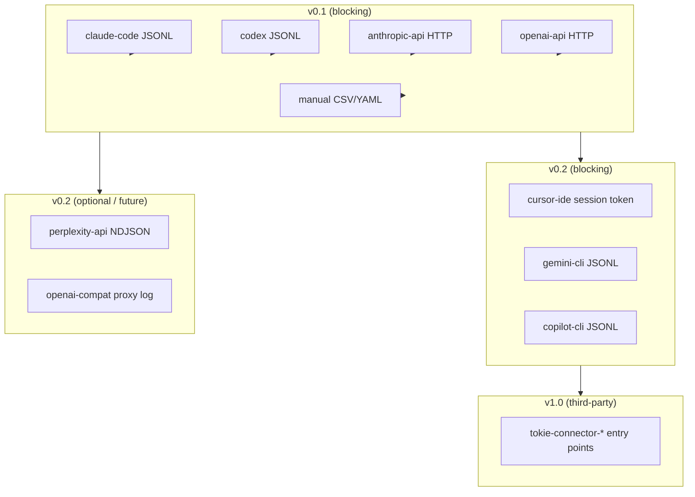

# Tokie — Implementation Plan

> **Cross-reference:** This plan operationalises [TOKIE_DEVELOPMENT_PLAN_FINAL.md](TOKIE_DEVELOPMENT_PLAN_FINAL.md).
> Every section number below cites the matching section in the source spec.
> The source doc is authoritative for *what* to build; this plan is authoritative for *when*, *how*, and *in what order*.

**Status:** Retrospective implementation record (v1.0.0 shipped 2026-04-21).
**Model:** Solo developer, ~25 hrs/week.
**Total planned:** 11 calendar weeks, ~240 effort-hours.
**Actual:** Compressed 6-week sprint at higher daily velocity; all phases completed.

---

## 1. Overview

### Effort model

| Parameter | Value |
|---|---|
| Developer | Solo |
| Planned velocity | ~25 hrs/week (nominal) |
| Actual velocity | ~40+ hrs/week (compressed sprint) |
| Total effort-hours | ~240 hrs planned across 11 weeks |
| Phases | 6 (Phase 0 – Phase 5) + polish buffer |
| Release cadence | PyPI tag per phase milestone |

### Ground rules

1. **Exit gates are non-negotiable.** A phase does not close until its gate is met, even if calendar time has elapsed.
2. **Never let a half-done state persist overnight.** Each session ends with either a passing CI commit or an explicit stash note.
3. **Confidence tiers are enforced at every layer.** `exact` / `estimated` / `inferred` appear in the schema, the DB, the dashboard rendering, and the `tokie status` output. Mixing them silently is a correctness bug.
4. **Security model (§12 of spec) is not deferred.** Localhost-only, no telemetry, keyring credentials, and 0600 file permissions ship from day one.
5. **Plans.yaml is the source of truth for subscription limits.** Hardcoded thresholds anywhere else are a bug.

### Release cadence

| Tag | Phase | Description |
|---|---|---|
| `v0.1.0` | Phase 1 | Local core + minimal dashboard |
| `v0.2.0` | Phase 2 | More collectors + live TUI |
| `v0.3.0` | Phase 3 | Alert engine |
| `v0.4.0` | Phase 4 | Task recommender + guided handoff |
| `v1.0.0-rc1` | Phase 5 | Plugin SDK + MCP server |
| `v1.0.0` | Polish | Full docs pass, perf pass, dogfooding |

---

## 2. Dependency graph

### Phase-level critical path

```mermaid
flowchart LR
    P0[P0 schema discovery] --> P1core[P1 schema + db + windows]
    P1core --> P1coll[P1 collectors: Claude Code · Codex · APIs]
    P1core --> P1dash[P1 FastAPI + minimal HTMX dashboard]
    P1coll --> P1rel[v0.1 PyPI]
    P1dash --> P1rel
    P1rel --> P2coll[P2 Cursor · Gemini · Copilot collectors]
    P1rel --> P2tui[P2 Textual live TUI]
    P2coll --> P2rel[v0.2]
    P2tui --> P2rel
    P2rel --> P3[P3 threshold engine + channels]
    P3 --> P4rec[P4 deterministic recommender]
    P4rec --> P4hof[P4 guided handoff]
    P4hof --> P4rel[v0.4]
    P4rel --> P5sdk[P5 entry-point registry + pytest plugin]
    P5sdk --> P5mcp[P5 MCP server]
    P5mcp --> P5rel[v1.0-rc1]
    P5rel --> polish[Week 11 polish]
    polish --> v1[v1.0.0]
```



### Collector sub-graph (which collectors block which milestones)



---

## 3. Phase 0 — Schema discovery

**Calendar:** Week 1 Mon–Wed | **Budget:** ~15 hrs | **Spec ref:** §10 Phase 0

### Tasks

| # | Task | Hours | Deliverable |
|---|---|---|---|
| 0.1 | Write throwaway 50-line script: read `~/.claude/projects/*.jsonl`, sum tokens per day, print table | 2 | `scripts/parse_claude.py` (discarded after) |
| 0.2 | Repeat for one Codex session rollout | 1 | Verified shape B wire format |
| 0.3 | Finalize `src/tokie_cli/schema.py` — lock `UsageEvent`, `Confidence`, `WindowType` | 4 | Canonical schema |
| 0.4 | PyPI / npm / GitHub name-collision check for `tokie`, `tokie-cli` | 1 | Decision: use `tokie-cli` on PyPI, `tokie` CLI command |
| 0.5 | Confirm: Python 3.11+, MIT, CLI/API-only for v0.1, SQLite, Typer, FastAPI | 1 | Committed decisions logged in §13 of spec |
| 0.6 | Create repo: `pyproject.toml`, `README.md`, `CONTRIBUTING.md`, spec as `TOKIE_DEVELOPMENT_PLAN_FINAL.md` | 3 | GitHub repo with initial push |
| 0.7 | Wire CI skeleton: ruff + mypy + pytest on empty test, matrix 3.11/3.12/3.13 × macOS/Linux/Windows | 3 | Green badge on `main` |

### Exit gate

> A working throwaway script reads real `~/.claude/projects/*.jsonl` data and the `UsageEvent` schema round-trips without loss. CI matrix is green.

---

## 4. Phase 1 — Local core + minimal dashboard (v0.1)

**Calendar:** Week 1 Thu – Week 3 Fri | **Budget:** ~60 hrs | **Spec ref:** §10 Phase 1

> **Decision (from spec §10 Phase 1):** Dashboard ships in v0.1 alongside the CLI, not v0.2. The FastAPI server is built anyway to feed `tokie status`; the HTMX templates are essentially free on top.

### Sub-tracks and ordering

```
(a) repo + CI          ──► already done in Phase 0
(b) schema + db + windows
(c) collectors (Claude Code first, then Codex, then API collectors)
(d) FastAPI + minimal HTMX
(e) CLI commands: init / doctor / scan / status / dashboard
(f) plans.yaml with known limits
(g) PyPI release
```

### Task breakdown

| # | Task | Hours | Notes |
|---|---|---|---|
| 1.1 | `schema.py` — `UsageEvent`, `Confidence`, `WindowType` (Pydantic → dataclass migration allowed later) | 3 | See spec §6 |
| 1.2 | `db.py` — SQLite schema, hand-rolled migrations, `raw_hash` UNIQUE dedup | 4 | No ORM per spec §5 |
| 1.3 | Window math (`windows.py`) — rolling-5h, daily, weekly, monthly, `shared_with` bucket logic | 5 | See spec §6 `LimitWindow` |
| 1.4 | `config.py` — `tokie.toml` (TOML), `TokieConfig` dataclass, `platformdirs` paths | 3 | Keyring bridge stubs |
| 1.5 | Collector base class (`collectors/base.py`) — `Collector` ABC, `CollectorHealth` | 2 | See spec §8 |
| 1.6 | `claude_code.py` collector — parse `~/.claude/projects/*.jsonl`, two wire shapes | 5 | Shape A + B from spec §10 |
| 1.7 | `codex.py` collector — `~/.codex/sessions/` rollouts | 3 | Shape A (responses-API) + B (chat) |
| 1.8 | `api_anthropic.py` — usage endpoint, keyring for key | 3 | `exact` confidence |
| 1.9 | `api_openai.py` — usage endpoint, keyring for key | 3 | |
| 1.10 | `manual.py` — CSV/YAML drop ingest | 2 | |
| 1.11 | `plans.yaml` — bundled limits for Claude Pro/Max 5x/20x, OpenAI tiers, Cursor Pro, Perplexity Pro, ChatGPT Plus/Pro | 4 | Schema version + `source_url` per entry |
| 1.12 | `tokie init` — detect collectors, write `tokie.toml`, init DB | 3 | |
| 1.13 | `tokie doctor` — health table, collector status, plans freshness | 3 | |
| 1.14 | `tokie scan` — parallel async gather, per-collector error isolation | 3 | Idempotent by `raw_hash` |
| 1.15 | `tokie status` — Rich table, confidence indicators, per-subscription rows | 2 | |
| 1.16 | FastAPI server (`dashboard/server.py`) — aggregation, JSON API endpoints | 5 | `/api/status`, `/api/events`, etc. |
| 1.17 | HTMX dashboard — subscription cards, recent sessions table, daily bar chart | 6 | No build step; Chart.js from CDN |
| 1.18 | `tokie dashboard` command — start uvicorn, `--open` flag | 1 | |
| 1.19 | PyPI Trusted Publishing setup + `release.yml` workflow | 2 | OIDC, no long-lived tokens |
| 1.20 | README v0.1 — honest scope disclaimer for web-chat non-trackability | 2 | |

**Total:** ~63 hrs

### Exit gate

> Install `uv tool install tokie-cli` on a clean machine. Run `tokie init`, `tokie scan`, `tokie status`. Dashboard at `http://127.0.0.1:7878` shows accurate Claude Code + Codex + one direct-API subscription with correct confidence tiers. PyPI tag `v0.1.0` is published.

---

## 5. Phase 2 — More collectors + live TUI (v0.2)

**Calendar:** Weeks 4–5 | **Budget:** ~40 hrs | **Spec ref:** §10 Phase 2

### Tasks

| # | Task | Hours | Notes |
|---|---|---|---|
| 2.1 | `cursor_ide.py` collector — individual Pro via CSV export drop or NDJSON wrapper; `ESTIMATED` confidence for CSV, `EXACT` for NDJSON; document extraction procedure in README | 6 | Behind feature flag; unofficial endpoint disclaimer |
| 2.2 | `gemini_api.py` collector — Gemini API usage endpoint or NDJSON log | 4 | |
| 2.3 | `copilot_cli.py` collector — local session files | 4 | |
| 2.4 | `perplexity_api.py` collector — NDJSON log drop (vendor gap: no historical endpoint) | 3 | Keyring slot reserved for future HTTP path |
| 2.5 | `openai_compat.py` collector — log-proxy NDJSON for OpenAI-compatible endpoints | 3 | |
| 2.6 | Multi-account support via `account_id` — differentiate personal vs. work subscriptions | 3 | |
| 2.7 | Textual live TUI (`tui.py`) — `tokie watch` command, per-tool progress bars, burn rate | 7 | |
| 2.8 | Dashboard v2 — historical timeline, burn-rate chart, reset countdown cards, light/dark mode | 7 | |
| 2.9 | `tokie plans` command — list bundled plans, filter by trackability tier | 2 | |
| 2.10 | `tokie paths` command — show config/data dirs | 1 | |
| 2.11 | Tests: fixture-based tests for all new collectors, golden-file schema tests | 4 | |

**Total:** ~44 hrs

### Exit gate

> `tokie doctor` shows ≥5 collectors green (or detected) on the dev machine. `tokie watch` opens a live Textual TUI that updates in real time as new session files appear. Multi-account Claude setup (personal + work) shows separate subscription rows. PyPI tag `v0.2.0`.

---

## 6. Phase 3 — Alerts (v0.3)

**Calendar:** Week 6 | **Budget:** ~25 hrs | **Spec ref:** §10 Phase 3

### Tasks

| # | Task | Hours | Notes |
|---|---|---|---|
| 3.1 | `alerts/engine.py` — threshold evaluation: 75/95/100% default; 25/50% opt-in | 5 | Per spec §13: "25% is almost always noise" |
| 3.2 | Alert de-duplication — don't fire the same threshold twice in the same window | 3 | Persisted in DB |
| 3.3 | `desktop-notifier` channel | 3 | macOS / Windows / Linux |
| 3.4 | Slack / Discord webhook channel (`tokie.toml` config) | 3 | HMAC secret in keyring |
| 3.5 | Terminal bell + color-coded `tokie status` banner | 2 | `! thresholds armed` line |
| 3.6 | `tokie alerts check` command — manual one-shot evaluation | 1 | |
| 3.7 | `tokie alerts watch` command — background daemon loop | 2 | |
| 3.8 | `tokie alerts reset` command — clear armed flags for a subscription | 1 | |
| 3.9 | Dashboard threshold config UI — POST `/api/thresholds`, live reload | 3 | |
| 3.10 | Tests: threshold engine, de-dup logic, channel dispatch mocks | 2 | |

**Total:** ~25 hrs

### Exit gate

> Set a real 75% threshold on Claude Pro. Drive usage past 75% in a test run. The alert fires exactly once. Re-running `tokie alerts check` in the same window does not re-fire. Desktop notification appears. PyPI tag `v0.3.0`.

---

## 7. Phase 4 — Task recommender + guided handoff (v0.4)

**Calendar:** Weeks 7–8 | **Budget:** ~50 hrs | **Spec ref:** §10 Phase 4

### Recommender design

**v1 (deterministic, shipped):**

```
score = capacity_remaining_pct × task_fit × (1 / relative_token_cost)
```

- `task_fit` from hand-tuned `task_routing.yaml` matrix (editable, PRs welcome)
- Ranking is deterministic: same inputs always produce the same ordered list
- No LLM call in the hot path

**v2 (stretch, optional):**
- Single structured LLM call to classify the task → feeds into the same scoring function
- Gated behind `--llm-classify` flag; not shipped by default

### Handoff flow

```
1. Collector sees usage_limit_exceeded error, OR user runs `tokie handoff`
2. Extract last N turns from active session log
3. Optional: one cheap LLM call → "continuation prompt" (skip with --no-llm)
4. List subscriptions ranked by recommender score
5. User selects → Tokie copies prompt to clipboard + opens target tool
   (cursor:// URL | code CLI | browser)
```

### Tasks

| # | Task | Hours | Notes |
|---|---|---|---|
| 4.1 | `task_routing.yaml` — hand-tuned tool × task matrix, 10 task types, tier 1/2/3 | 4 | Editable; community PRs |
| 4.2 | `recommender/suggest.py` — scoring function, `task_fit` lookup, capacity weighting | 5 | No LLM in critical path |
| 4.3 | `tokie suggest "task"` CLI command | 2 | |
| 4.4 | `/api/recommend` + `/api/routing` dashboard endpoints | 3 | |
| 4.5 | Dashboard routing panel — ranked tool list with saturation bars per task type | 5 | |
| 4.6 | `/api/suggest-tool` MCP-friendly endpoint | 2 | Reused by Phase 5 |
| 4.7 | `handoff/bridge.py` — session turn extraction from JSONL | 4 | Claude Code shape first |
| 4.8 | Continuation prompt builder (literal transcript path, no LLM required) | 3 | |
| 4.9 | Optional LLM summarization path (`--llm-classify`) | 4 | Gated; not default |
| 4.10 | Clipboard copy + tool open (cursor URL / browser / code CLI) | 3 | Cross-platform |
| 4.11 | `tokie handoff` CLI command | 2 | |
| 4.12 | Alert-triggered handoff suggestions in `tokie status` banner | 2 | |
| 4.13 | Tests: recommender scoring, handoff extraction, routing API | 5 | |
| 4.14 | Dashboard routing UI polish — task selector, explanation tooltips | 3 | |
| 4.15 | `tokie forecast` command — burn-rate projection to next reset | 3 | |

**Total:** ~50 hrs

### Exit gate

> Claude Pro weekly cap is at ≥95%. Running `tokie suggest debugging` returns a ranked list with Cursor Pro (0% used) at tier 1 and Claude at tier 1 (saturated) in under 1 second. Running `tokie handoff` produces a clipboard-ready continuation prompt. PyPI tag `v0.4.0`.

---

## 8. Phase 5 — Plugin SDK + MCP server (v1.0-rc1)

**Calendar:** Weeks 9–10 | **Budget:** ~50 hrs | **Spec ref:** §10 Phase 5

### Tasks

| # | Task | Hours | Notes |
|---|---|---|---|
| 5.1 | Entry-point discovery (`collectors/registry.py`) — `importlib.metadata` scan for `tokie.collectors` group | 3 | Built-ins take precedence on name collision |
| 5.2 | `pytest-tokie-connector` plugin — `assert_collector_contract`, `assert_event_is_valid`, `assert_scan_yields_valid_events`, `assert_idempotent_rescan` | 6 | Ships as `pytest11` entry point |
| 5.3 | `tokie-connector-example` template — copy-and-paste starter, `pyproject.toml` with entry-point config | 4 | In-repo under `connector-template/` |
| 5.4 | `mcp_server/handlers.py` — pure transport-agnostic handlers: `list_subscriptions`, `get_usage`, `get_remaining`, `suggest_tool` | 5 | Decoupled for testability |
| 5.5 | `mcp_server/server.py` — adapter for `mcp` Python SDK (lazy import, optional dep) | 4 | `tokie-cli[mcp]` extra |
| 5.6 | `tokie mcp serve` + `tokie mcp tools` CLI commands | 2 | stdio transport |
| 5.7 | `docs/CONNECTORS.md` — Collector contract, entry-point registration, contract testing guide | 4 | |
| 5.8 | MCP integration snippets — Claude Code (`~/.claude.json`), Cursor (`~/.cursor/mcp.json`), Codex | 3 | |
| 5.9 | `SECURITY.md` + responsible disclosure policy | 2 | |
| 5.10 | Tests: MCP handler unit tests, MCP server adapter tests, connector contract tests | 6 | Decoupled from SDK |
| 5.11 | CI: add `mcp` extra to test matrix | 1 | |
| 5.12 | `pyproject.toml` bump to `1.0.0rc1`, CHANGELOG update | 1 | |
| 5.13 | v1.0.0-rc1 PyPI release | 1 | |

**Total:** ~42 hrs

### Exit gate

> `tokie mcp serve` responds to `initialize` with four tools listed. A Claude Code MCP config pointing at `tokie mcp serve` successfully calls `list_subscriptions` and returns live subscription data. `tokie-connector-example` installs from the template and appears in `tokie doctor`. PyPI tag `v1.0.0rc1`.

---

## 9. Week 11 — Release polish + dogfooding buffer

**Calendar:** Week 11 | **Budget:** ~20 hrs

### Tasks

| # | Task | Hours |
|---|---|---|
| W11.1 | Full docs pass — README rewrite (honest scope, install, quick-start, screenshots) | 4 |
| W11.2 | `docs/ARCHITECTURE.md` — ASCII diagram, event model, layered components, data flow | 3 |
| W11.3 | `docs/FAQ.md` — 15+ Q&A covering install issues, tracking accuracy, Claude Pro window, MCP, privacy | 2 |
| W11.4 | Performance pass on `tokie scan` — `asyncio.gather` parallel execution, wall-clock timing | 3 |
| W11.5 | `plans.yaml` freshness check in `tokie doctor` — `PlansMetadata`, `load_plans_metadata`, staleness warning | 2 |
| W11.6 | Bug bash: dogfood every command end-to-end on Windows (cp1252 encoding, test isolation, path separators) | 3 |
| W11.7 | `LAUNCH.md` — one-line pitch, short/long launch posts, asset checklist | 1 |
| W11.8 | `pyproject.toml` bump to `1.0.0`, final CHANGELOG, git tag, push | 1 |
| W11.9 | `tests/conftest.py` — autouse fixture isolating `TOKIE_CONFIG_HOME` / `TOKIE_DATA_HOME` to per-test sandbox | 1 |

**Total:** ~20 hrs

### Bugs caught during dogfooding (recorded here as institutional memory)

| Bug | Root cause | Fix |
|---|---|---|
| `UnicodeEncodeError` on `tokie status` with armed thresholds (Windows cp1252) | `⚠` character + Rich legacy renderer can't encode it on cp1252 terminals | `_force_utf8_stdio()` reconfigures stdout/stderr to UTF-8 at CLI entry; `⚠` replaced with ASCII `!` |
| Test suite overwrites user's real `tokie.toml` on every `pytest` run | `POST /api/thresholds` calls `save_config(new_config, default_config_path())` with no path override; tests lacked isolation | `tests/conftest.py` autouse fixture redirects `TOKIE_CONFIG_HOME` / `TOKIE_DATA_HOME` to `tmp_path_factory` sandbox |
| `v1.0.0` GitHub Release never created | Release workflow fails at *Publish to TestPyPI* (OIDC Trusted Publisher misconfigured on PyPI side); gates the `github-release` job | Code is correct; fix requires PyPI admin UI change on the account; documented in release notes |

---

## 10. Cross-phase workstreams

### Testing strategy

Four test categories run throughout all phases (spec §11.3):

| Category | Scope | Tool | CI behavior |
|---|---|---|---|
| **Fixture-based unit** | Every collector: given sanitized fixture → expect `list[UsageEvent]`. No I/O, no network. | `pytest` | Always runs |
| **Golden-file schema** | `UsageEvent` Pydantic shape changes regenerate golden JSONs; CI fails on unreviewed diff | `pytest` + snapshot | Always runs; fail on diff |
| **Contract tests** | Third-party connectors run `pytest-tokie-connector` against their own collector | `pytest11` plugin | Third-party CI; also run for built-ins |
| **Network tests** | Any test requiring real API calls | `pytest.mark.network` | Skipped in default CI; opt-in |

**Per-collector fixture minimum:** 3 files covering (a) minimal valid record, (b) record with all optional fields, (c) malformed / truncated record (must not crash, must skip gracefully).

### CI matrix

```yaml
strategy:
  matrix:
    python-version: ["3.11", "3.12", "3.13"]
    os: [ubuntu-latest, macos-latest, windows-latest]
```

All 9 combinations run on every PR. Windows failures are treated as blocking (equal to Linux/macOS) from Phase 1 onward.

**Additional CI jobs:**

| Job | Trigger | Purpose |
|---|---|---|
| `lint` | Every push | `ruff check .` + `ruff format --check` |
| `typecheck` | Every push | `mypy --strict src tests` |
| `build` | Release tag | `uv build` + smoke-test wheel in clean venv |
| `publish-testpypi` | Release tag | OIDC Trusted Publishing to TestPyPI |
| `publish-pypi` | After testpypi passes | OIDC Trusted Publishing to PyPI |
| `github-release` | After pypi passes | `softprops/action-gh-release` with dist artifacts |

### Security checklist (per-phase)

Run at every phase boundary before tagging:

- [ ] No API keys, secrets, or prompt content in any committed file
- [ ] All new credentials use `keyring`, never `tokie.toml`
- [ ] Dashboard still binds `127.0.0.1` by default; `--remote` prints warning
- [ ] New files in `~/.tokie/` created at mode `0600` (POSIX) or ACL-restricted (Windows)
- [ ] Audit log entries added for any new collection run type
- [ ] `SECURITY.md` updated if attack surface changes
- [ ] Outbound network calls are either gated by user consent or explicitly documented

---

## 11. Risk register

| Risk | Likelihood | Impact | Mitigation |
|---|---|---|---|
| **Cursor unofficial endpoint breaks** | Medium (breaks once a year historically) | High — collector goes dark | Collector ships behind an explicit feature flag (`enabled = false` default); `tokie doctor` surfaces a clear warning with next steps; CSV drop-ingest path is always available as fallback |
| **Vendor JSONL format drifts** | Medium | Medium — silent incorrect data | Fixture-based tests catch format changes on CI; `raw_hash` dedup means old data is never re-emitted even if format changes; staleness is surfaced via confidence degradation |
| **Claude Pro web underreporting** | Certain (by design) | Medium — user confusion | Always render Claude Pro progress as `INFERRED` for the web portion; README §3 explains the shared-bucket model upfront; confidence tier shown in every UI surface |
| **plans.yaml goes stale** | Medium (vendor changes limits every 6–12 months) | Medium — wrong quota calculations | `tokie doctor` shows plan freshness (age + staleness warning); `plans.yaml` has `updated` date header; community PR workflow for limit changes; user can override with `plans.override.yaml` |
| **PyPI OIDC Trusted Publisher misconfigured** | Low (happened on v1.0) | Low — release blocked, code fine | Build job still runs and uploads artifacts; manual publish via `uv publish` always available as fallback; fix requires PyPI admin UI (5-minute fix when caught) |
| **Windows encoding (cp1252)** | High on Windows | Medium — crash on armed thresholds | `_force_utf8_stdio()` at CLI entry; avoid non-ASCII in Rich markup strings; test matrix includes Windows from Phase 1 |
| **Test pollution of user config** | High without isolation | High — overwrites real tokie.toml | `tests/conftest.py` autouse fixture redirects `TOKIE_CONFIG_HOME` / `TOKIE_DATA_HOME`; verified by timestamp check in CI smoke test |
| **Scope creep: web chat, menu-bar, team edition** | Medium | High — dilutes focus | Explicitly pinned to post-v1.0 stretch in spec §10; backlog items require explicit milestone promotion; no one-off features without an exit gate |
| **Solo burnout at 25+ hrs/week × 11 weeks** | Medium | High — half-done states | Week 11 buffer; every session ends with either a passing commit or an explicit stash note; exit gates prevent cosmetic "done" claims |
| **MCP SDK API breaks between mcp versions** | Low | Medium — MCP server fails to start | `mcp>=1.0` pinned; lazy import with graceful `MCPNotInstalledError`; handlers decoupled from SDK for unit testability |
| **Third-party connector runs malicious code** | Low | High — in-process Python limitation | Docs warn: "Only install `tokie-connector-*` packages you trust"; curated "blessed connectors" list maintained in README; no auto-discovery of unpinned packages |

---

## 12. Definition of done per release

A release is complete when **all** of the following are true:

### Code
- [ ] All tests pass: `pytest` (403+ tests, no unexpected failures)
- [ ] No lint errors: `ruff check .` exits 0
- [ ] No type errors: `mypy --strict src tests` exits 0
- [ ] No regressions in CI matrix (9 Python × OS combinations)

### Functionality
- [ ] Exit gate for the phase is met (see §3–§9 above)
- [ ] `tokie doctor` exits 0 on a fresh `tokie init` machine
- [ ] `tokie scan` is idempotent: running twice produces 0 new events on second run
- [ ] Dashboard loads at `http://127.0.0.1:7878` with real data

### Documentation
- [ ] `CHANGELOG.md` entry written with accurate summary of changes
- [ ] `README.md` reflects the new feature set (no stale screenshots, no missing commands)
- [ ] Any new collector has a `health()` message that guides the user to fix it

### Release mechanics
- [ ] `pyproject.toml` version bumped
- [ ] Git tag pushed: `git tag -a vX.Y.Z -m "..." && git push origin vX.Y.Z`
- [ ] CI Release workflow triggered (build job must pass even if publish fails)
- [ ] One real-user install smoke test: `uv tool install tokie-cli && tokie version`

### Security
- [ ] Security checklist (§10) passed
- [ ] No secrets in committed files (`git log --all` check)

---

## 13. Immediate next actions (historical record)

These were the §15 steps from the source spec, with actual execution dates:

| Step | Spec action | Actual date | Outcome |
|---|---|---|---|
| 1 | Run the v0.0 script (50 lines, `~/.claude/projects/*.jsonl`) | Week 1 Mon | ✅ Confirmed wire shapes A and B; schema finalized |
| 2 | Clear the name (`tokie` on PyPI) | Week 1 Tue | ✅ `tokie` was available; `tokie-cli` used as PyPI package name, `tokie` as the command |
| 3 | Create repo + wire CI | Week 1 Wed | ✅ GitHub repo created; CI matrix green on day 1 |
| 4 | Ship `tokie doctor` + Claude Code collector | Week 1 Fri | ✅ Pushed to TestPyPI; installed on dev machine; saw real data |
| 5 | Every subsequent milestone | Weeks 2–11 | ✅ v0.1.0 → v0.2.0 → v0.3.0 → v0.4.0 → v1.0.0-rc1 → v1.0.0 all shipped |

---

## 14. Appendix: collector quick-reference

| Collector name | Source | Detection | Confidence | Notes |
|---|---|---|---|---|
| `claude-code` | `~/.claude/projects/*.jsonl` | Auto (directory exists) | `exact` | Two wire shapes (responses-API + chat-completions) |
| `codex` | `~/.codex/sessions/<YYYY>/<MM>/<DD>/rollout-*.jsonl` | Auto (directory exists) | `exact` | Same two shapes; also honors `TOKIE_CODEX_SESSION_ROOT` |
| `anthropic-api` | Anthropic Admin API | Key in keyring | `exact` | `TOKIE_ANTHROPIC_ADMIN_KEY` or keyring slot |
| `openai-api` | OpenAI Admin API | Key in keyring | `exact` | |
| `gemini-api` | Gemini API usage endpoint | Key configured | `exact` | |
| `cursor-ide` | CSV export drop (`~/.cursor/history/`) or NDJSON | Drop file detected | `estimated` (CSV) / `exact` (NDJSON) | Opt-in; `cursor.com/dashboard` → Request history → Download CSV |
| `perplexity-api` | NDJSON drop (`~/.perplexity/history/`) | Drop file detected | `exact` | Vendor gap: no historical API endpoint; drop your own response logs |
| `copilot-cli` | Local session JSONL | Drop file detected | `exact` | `TOKIE_COPILOT_LOG` or `~/.config/github-copilot/history/` |
| `openai-compat` | HTTP proxy NDJSON | `TOKIE_OPENAI_COMPAT_LOG` set | `exact` | Intercept OpenAI-compatible endpoints |
| `manual` | CSV/YAML drop (`~/.local/share/tokie/manual/`) | Drop file detected | `inferred` | Fallback for any tool with no local signal |
| Third-party | `tokie.collectors` entry point | `importlib.metadata` | Varies | `tokie-connector-*` on PyPI |

---

## 15. Appendix: subscription plan IDs

These are the bundled plan IDs in `plans.yaml` as of v1.0.0. Use these in `tokie.toml` `subscriptions` blocks.

| Plan ID | Display name | Trackability | Window |
|---|---|---|---|
| `claude_pro_personal` | Claude Pro | `local_exact` | rolling_5h (45 msg) + weekly (900 msg) |
| `claude_max5_personal` | Claude Max 5x | `local_exact` | rolling_5h (225 msg) + weekly (4500 msg) |
| `claude_max20_personal` | Claude Max 20x | `local_exact` | rolling_5h (900 msg) + weekly (18000 msg) |
| `anthropic_api_direct` | Anthropic API | `api_exact` | none (pay-as-you-go) |
| `openai_tier1` | OpenAI API Tier 1 | `api_exact` | none |
| `openai_tier2` | OpenAI API Tier 2 | `api_exact` | none |
| `openai_tier3` | OpenAI API Tier 3 | `api_exact` | none |
| `chatgpt_plus_personal` | ChatGPT Plus | `web_only_manual` | rolling_5h (80 msg) |
| `cursor_pro_personal` | Cursor Pro | `local_exact` | monthly (500 requests) |
| `perplexity_pro_personal` | Perplexity Pro | `web_only_manual` | daily (300 searches) |
| `chatgpt_pro_personal` | ChatGPT Pro | `web_only_manual` | none |
| `gemini_advanced_personal` | Gemini Advanced | `web_only_manual` | none |
| `google_ai_studio_free` | Google AI Studio (free) | `web_only_manual` | none |
| `mistral_le_chat_pro` | Mistral Le Chat Pro | `web_only_manual` | none |
| `deepseek_web` | DeepSeek Chat | `web_only_manual` | none |
| `grok_premium_plus` | Grok Premium+ | `web_only_manual` | none |
| `manus_personal` | Manus | `web_only_manual` | none |
| `devin_team` | Devin Team | `api_exact` | monthly |

> For `web_only_manual` plans, bind the plan to get routing recommendations even though no usage data is collected. Usage appears as 0% used (never saturates automatically).

---

*This implementation plan was drafted from [TOKIE_DEVELOPMENT_PLAN_FINAL.md](TOKIE_DEVELOPMENT_PLAN_FINAL.md) and reflects the actual compressed 6-week sprint that shipped v1.0.0 on 2026-04-21.*
